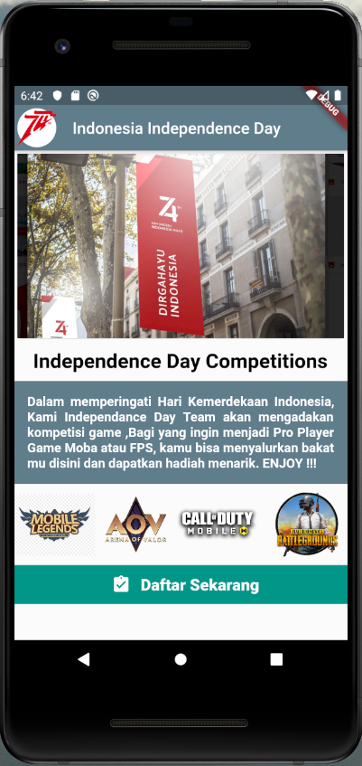

# Flutter Basic Apps ( Tugas 2 - OSG08 )
Aplikasi Flutter dengan tema Kemerdekaan untuk tugas ke-2 kelas OSG08.

## Screenshot
.

## Built With
- [Flutter](https://flutter.dev)

## Created By
- Arista Wahyu Saputra

## OSG08 - Flutter Basic
Dengan jangka waktu lebih kurang 2 bulan, peserta diharapkan dapat mengenal dan membuat aplikasi simple Flutter dengan menggunakan data dari internet (API).

## Cara Mendaftar Online Study Group OSG08
Untuk pendaftaran kelas selanjutnya, silahkan kunjungi atau hubungi kami di dawah ini.

## Info Lebih Lengkap
Website : [www.eudeka.id](https://www.eudeka.id).  
Twitter: [@EudekaID](https://twitter.com/EudekaID).  
Telegram : [@eudekainfo](https://t.me/eudekainfo).  
Instagram : [@eudeka.id](https://instagram.com/eudeka.id).  
WhatsApp : [0895351577557](https://wa.me/62895351577557).  
Email : [info@eudeka.id](mailto:info@eudeka.id).  

###### tags: `Samples` `Eudeka` `OSG08`